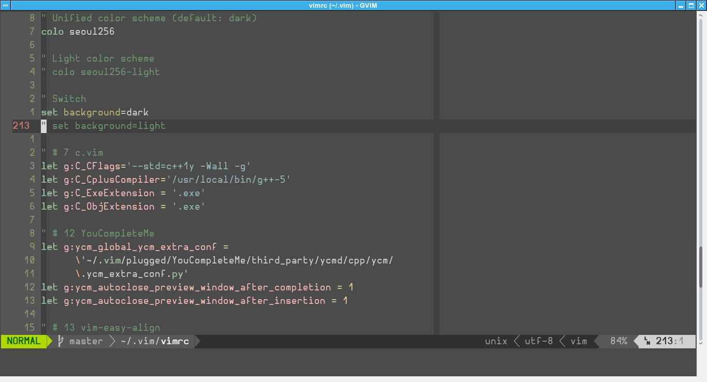
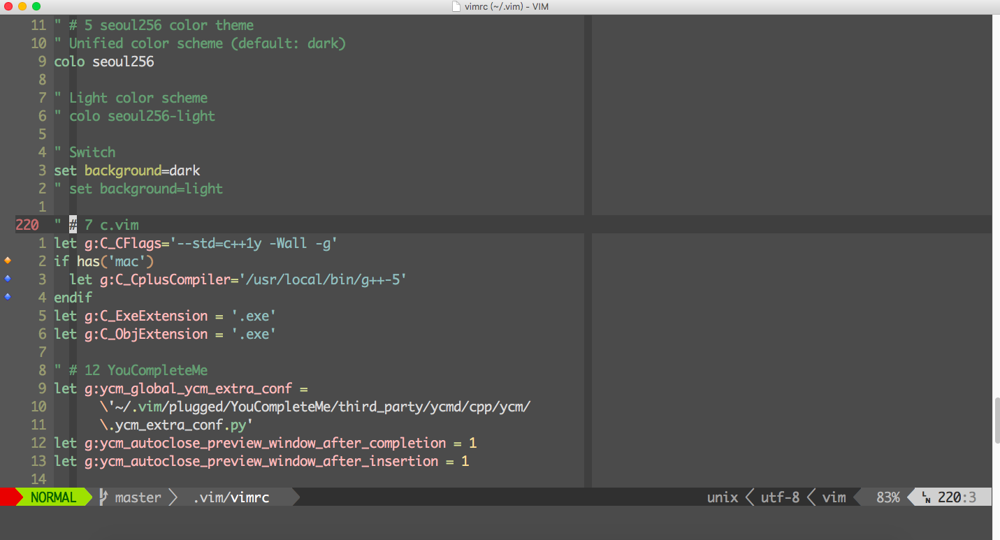

### Install

1. Backup your own configuration. Clone this repository into 
`~/.vim` then start vim.
2. run `:PlugInstall`, then wait for a long time to complete
`YouCompleteMe` plugin to finish installation. If your network
is slow, maybe you have to wait longer... Because it has many
dependencies. Or you can disable this plugin at first in the
vimrc
3. Then run the following command:
```
    cd ~/.vim/plugged/
    git submodule update --init vim-powerline/
    git submodule update --init vim-instant-markdown/
```
Because maybe the `vim-plug` plugin manager can not install these
two plugins properly.
4. To make that vim-instant-markdown plugin working on your 
system. refer to that 
[repository](https://github.com/suan/vim-instant-markdown)

### ScreenShot




Enjoy. ;-)
